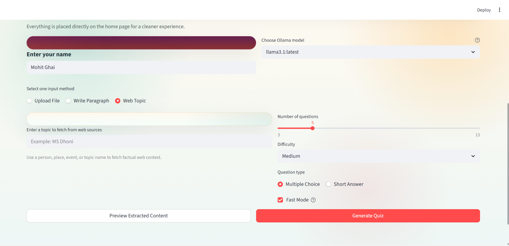
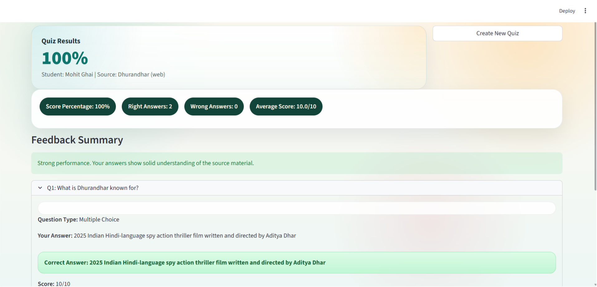
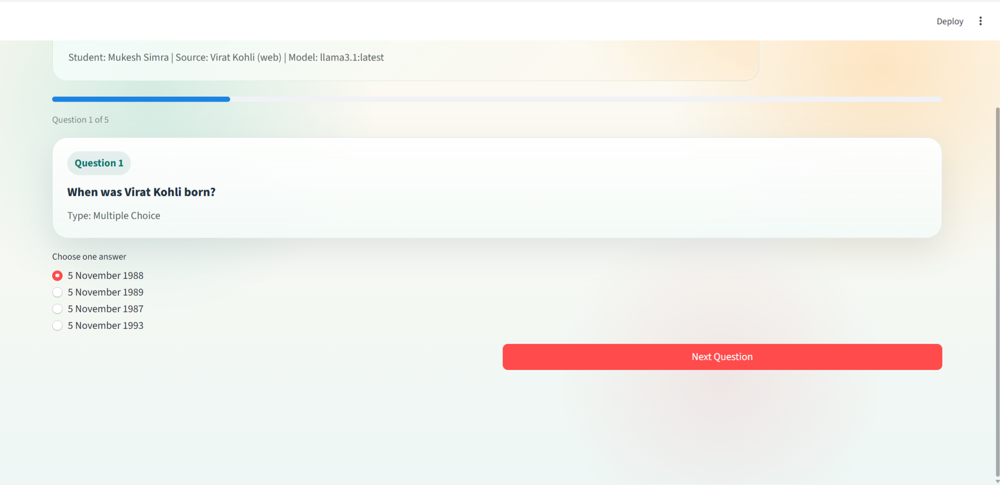
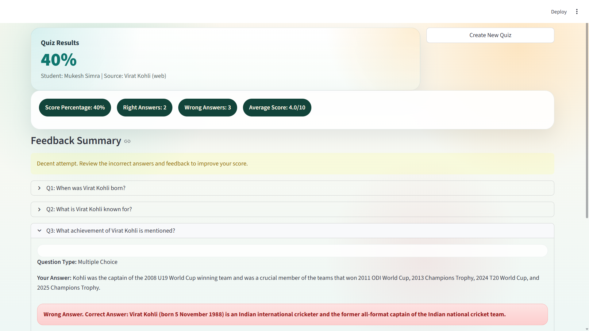

# AI Quiz App

An internship-ready Streamlit project that generates quizzes from uploaded documents, pasted text, or web topics and then evaluates user answers with clear feedback and scoring.

## Overview

This project lets a user:

- enter their name
- upload a `PDF`, `TXT`, `DOCX`, or `CSV` file
- paste a paragraph directly
- generate a quiz from a web topic such as a person, place, or event
- choose either `Multiple Choice` or `Short Answer`
- answer the quiz and receive a final result summary

The app supports both:

- `Ollama-based generation` for richer local AI question generation
- `Fast Mode` for quick local question creation without waiting on the model

## Screenshots

### Home Page



### Quiz Screen



### Result Screen





## Main Features

- Streamlit UI with a polished home page, quiz page, and result page
- Name-based quiz sessions
- Document ingestion for PDF, TXT, DOCX, and CSV
- Paragraph-based question generation
- Web topic mode for internet-assisted factual question generation
- Multiple Choice and Short Answer quiz support
- Automatic answer evaluation and feedback summary
- Correct and wrong answer highlighting in the result view
- Percentage score, average score, and right/wrong counts
- Downloadable JSON result export

## GitHub Repo Description

Use this in the GitHub repository `About` section:

`AI-powered Streamlit quiz app that generates MCQ and short-answer quizzes from documents, paragraphs, or web topics using Ollama and fast local fallback modes.`

## Tech Stack

- `Python`
- `Streamlit`
- `Ollama`
- `requests`
- `PyMuPDF`
- `python-docx`

## Project Structure

- `app.py` - main Streamlit app
- `modules/ingestion.py` - file and raw text ingestion
- `modules/question_gen.py` - document/text question generation
- `modules/web_research.py` - web topic lookup using web sources
- `modules/web_question_gen.py` - web-topic question generation
- `modules/evaluator.py` - answer evaluation
- `modules/session.py` - session persistence and result summary
- `modules/ollama_client.py` - Ollama connection helper
- `tests/` - test files

## Supported Input Modes

### 1. Upload File

Generate a quiz from:

- PDF
- TXT
- DOCX
- CSV

### 2. Write Paragraph

Paste a paragraph or short study note and generate questions from it.

### 3. Web Topic

Enter a topic such as:

- `MS Dhoni`
- `APJ Abdul Kalam`
- `World War 2`

The app fetches topic context from web sources and creates more factual questions.

## Quiz Modes

### Multiple Choice

- generates MCQ questions with options
- supports more factual question styles such as dates, places, achievements, and stats

### Short Answer

- generates direct written-answer questions
- evaluates the answer with feedback

## Fast Mode vs Ollama Mode

### Fast Mode

- faster
- does not depend on Ollama for document mode
- useful for quick demo/testing

### Ollama Mode

- better for richer AI-based question generation
- requires Ollama to be installed and running

## Setup Instructions

### 1. Clone the repository

```bash
git clone https://github.com/Ranpratapsingh/quiz_app.git
cd quiz_app
```

### 2. Install Python dependencies

```bash
python -m pip install -r requirements.txt
```

### 3. Install and run Ollama

Start Ollama:

```bash
ollama serve
```

Pull a model:

```bash
ollama pull llama3.1
```

You can also use another local Ollama model if available.

### 4. Run the Streamlit app

```bash
python -m streamlit run app.py
```

## How To Use

1. Open the app in the browser.
2. Enter your name.
3. Choose one input mode:
   - upload file
   - write paragraph
   - web topic
4. Choose the question type:
   - Multiple Choice
   - Short Answer
5. Select question count and difficulty.
6. Enable or disable Fast Mode.
7. Click `Generate Quiz`.
8. Answer all questions.
9. Review the final score, feedback, and correct/wrong answer summary.

## Demo Script

Use this short explanation during your internship demo:

1. `This is an AI Quiz App built with Streamlit.`
2. `The user enters their name and can create a quiz from a document, a pasted paragraph, or a web topic.`
3. `The app supports both Multiple Choice and Short Answer questions.`
4. `For local AI generation, it can use Ollama.`
5. `If Ollama is slow, Fast Mode can still generate questions quickly.`
6. `After answering the quiz, the app evaluates the responses and shows percentage score, right answers, wrong answers, and feedback summary.`
7. `This project demonstrates document ingestion, question generation, answer evaluation, and a complete user-friendly Streamlit workflow.`

## Evaluation Output

After submitting the quiz, the app shows:

- percentage score
- total correct answers
- total wrong answers
- average answer score
- per-question feedback
- colored result boxes for correct and wrong answers

## Notes

- For standard AI-based generation, Ollama should be running locally.
- For web topic mode, internet access is required.
- Fast Mode is useful if Ollama is slow or unavailable.
- Question quality in Fast Mode is simpler than full LLM-based generation.

## Future Improvements

- stronger MCQ distractor generation
- more robust web-source coverage
- topic-specific quiz templates
- export to PDF or CSV
- admin analytics dashboard

## Author

Ranpratap Singh
